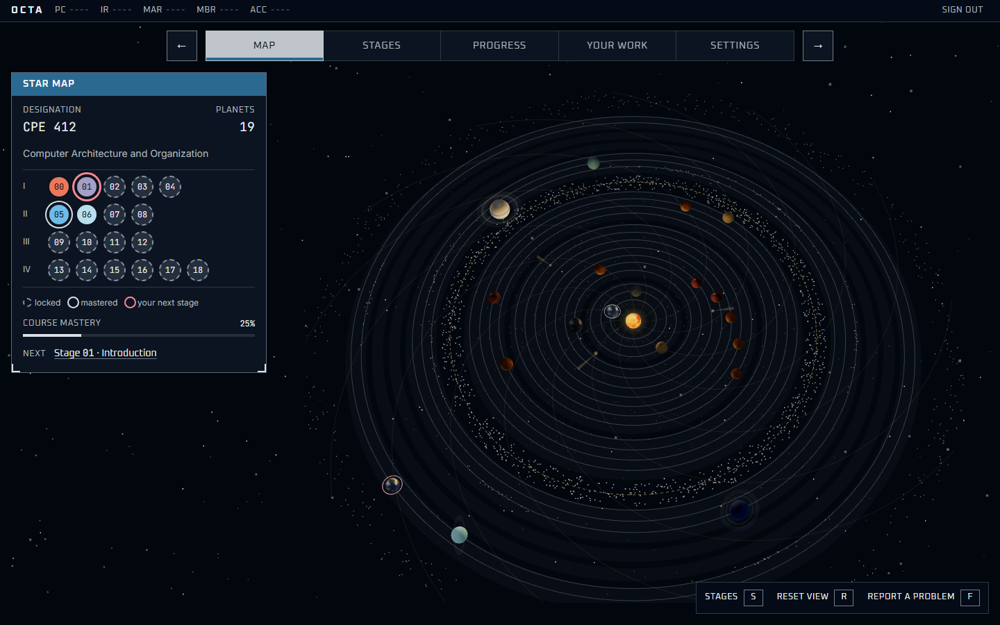
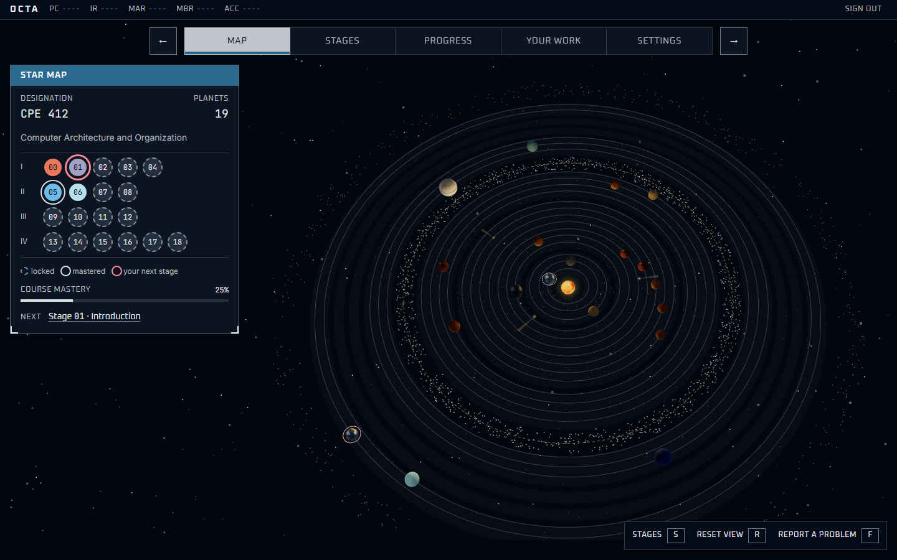
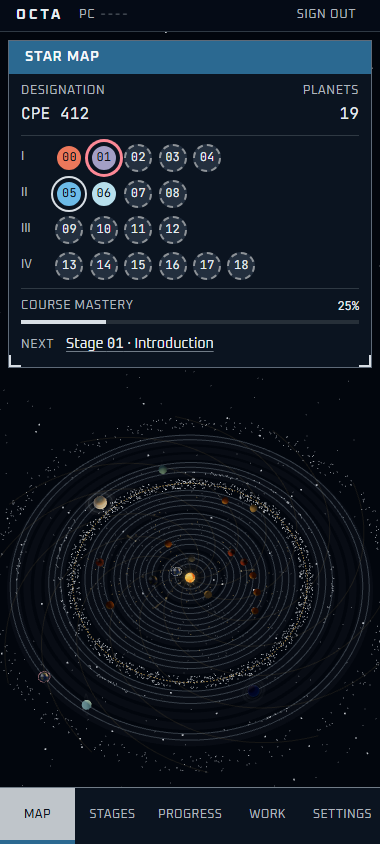
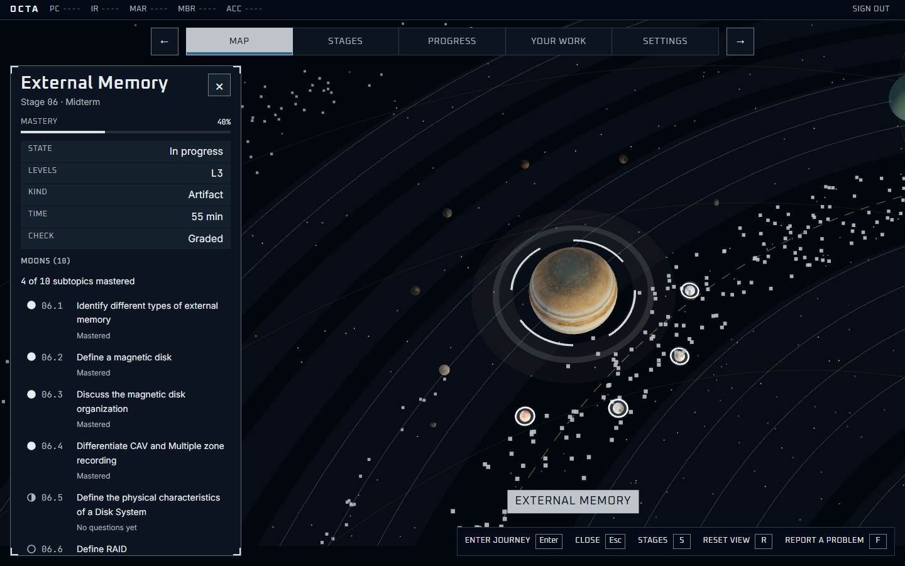
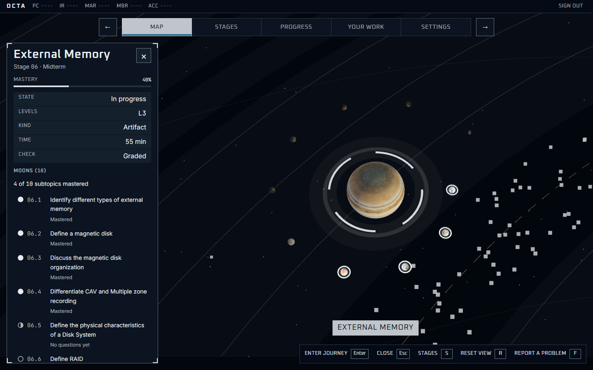
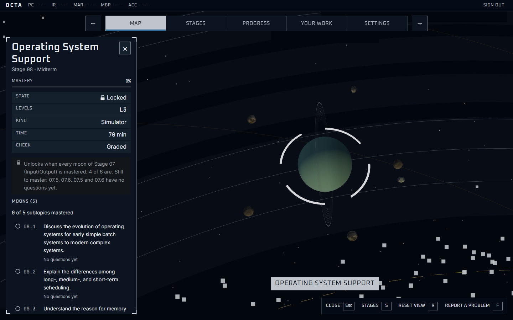
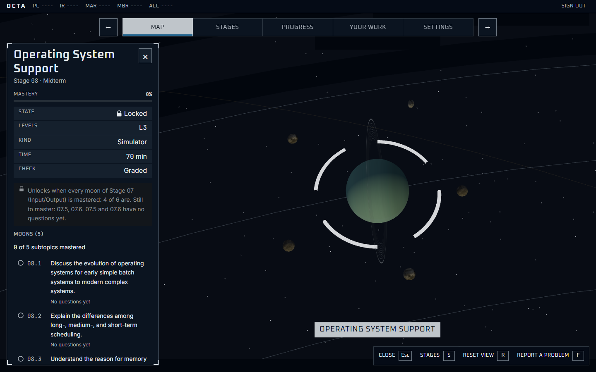

# `/app` — the 3D map, and the only map — SPEC

Ruling 2 (30 Sep 2026, `WEB-REMAKE.md` §0.3-§0.5). Templates:
`template.png` (Starfield's system map: the system centred, a SYSTEM and a BODY
panel on the left, a key-hint bar bottom right) and `template-zoom.png` (the
same panel after zooming into a body). Both copied from
`_direction/star/` (sources, statuses and what they show are in
`_direction/SOURCE.md`); both opened before use. Gate:
`design/specs/web-app.spec.ts`. Replaced `solar-system.spec.ts`,
`before-baseline.spec.ts` and `web-map.spec.ts`, whose subject (the flat map
and its ladder) is removed.

## Realm

The star system: `html[data-realm="star"]`, no `data-biome`.

## What it shows

- **The scene** (`map/StarMapScene.tsx`, lazy, `aria-hidden`): the sun, one
  orbit ring per planet radius, 19 planets on circular orbits (radius = the
  stage's level, `computeSolarLayout`) moving by Kepler's third law
  (`solar-system/orbit.ts`, 6 unit tests), each tinted by its OWN biome
  (`--biome-planet-<biome>`, per planet since 30 Sep); locked planets drawn in
  `--locked`; a ring on mastered planets; the student's next stage ringed in
  their accent (their own place, never a state); the chosen planet's reticle,
  moons and name tag. The camera fits and centres the system in the space the
  panels leave (measured), eases to a chosen planet, and yaws on drag.
- **SYSTEM panel** (the accessible layer): designation, planet count, the
  course, the row of bodies (one radio per planet, grouped by act, named
  "Stage 04 · Cache Memory, locked"), a key to the rings, course mastery as a
  printed meter, and the next stage. **Shown only while no planet is chosen**
  (instructor, 1 Oct 2026), at every width: choosing one hides it (`hidden`,
  so its radios stay in the DOM) and moves focus to the body panel's heading;
  Close brings it back with focus on the planet just left.
- **BODY panel**: the planet's name, stage and act, its mastery meter (or "Not
  graded"), a stat table (state in words with a padlock when locked, levels,
  kind, time, check), the lock's reason verbatim, the approved summary, its
  moons (objectives, in the syllabus's order), and Enter journey (open) or
  Show Stage NN (locked). A bottom sheet on a phone. While it is open, Left
  and Right step to the neighbouring planet (the row's arrow keys, carried
  over, since the row is hidden then).
- **The name** (instructor, 1 Oct 2026): the chosen planet's title, or "Moon
  NN.N", centred at the bottom of the free area (above the key hints at 1440,
  above the sheet at 380), wrapping rather than overflowing. `aria-hidden`:
  the panel's heading says it to a screen reader. It replaces the tag that
  followed the planet across the screen.

## Skins: real textures (1 Oct 2026, the instructor's request)

- **Every body wears a real planetary surface** (`solar-system/bodies.ts`;
  Solar System Scope's maps, CC BY 4.0, credited in `public/CREDITS.md`;
  downsized to 1024×512, 17 files, each under 200 KB, served from
  `public/textures/` so none enters a bundle). `bodies.spec.ts`: every file
  exists, is under 200 KB, is credited; a skin is seeded, never random.
- **A planet's skin follows its biome**, so the map and the world a student
  enters agree: desert is Mars or Venus, ocean Neptune, Earth or Uranus,
  arctic Uranus or an icy dwarf, city Jupiter, Saturn or Neptune, cave
  Mercury, the Moon or Ceres, jungle Earth or Venus's clouds. The choice in a
  biome is seeded from the student's rotation and the stage (FNV-1a), so the
  same student sees the same system every session and students differ.
- **Kinds are drawn apart:** gas giants 1.45× the size the moon count gives,
  ringed 1.3×, ice 1.15×, rocky 0.9×. Earth-likes carry a cloud layer, ringed
  giants a ring from a radial alpha strip, gas giants flatten at the poles and
  their bands drift, Uranus rolls on its side.
- **Moons wear the small bodies** (the Moon, Ceres, Eris, Makemake, Mercury,
  Haumea), seeded per objective.
- **The sun** is its own surface, unlit, inside a corona and a halo drawn as
  soft radial sprites in `--sun-glow` (the first cut, two translucent
  spheres, read as a flat brown disk with a rim, caught in the planet-09
  capture).
- **Cosmetic only.** A skin never touches a lock, a ring, a mastery or a moon
  count. A locked planet is drawn in `--locked` over its surface; a moon's
  three states are still its glow and rings. Until a texture arrives a body
  wears its biome's tint, so nothing blanks; a texture that fails costs only
  that surface.

## Moons (R4.2, R4.3, R4.6; WEB-REVAMP 3.1-3.3, 3.7a, 3.10; 30 Sep 2026)

- **A gradeable planet's moons are its objectives**, in the syllabus's order,
  drawn while the planet is chosen, each on its own circular orbit by the
  planets' Kepler law. **Three states, one level down from a planet's**: dim
  (nothing right yet, drawn in `--locked`), a partial glow (one question right),
  a full glow with a ring (mastered: 2 different questions right). Every fact
  is the server's (`correct`, `mastered`, `questions` per objective, 3.7a); the
  client names and draws it, and decides nothing
- **The planet panel** says "N of M subtopics mastered" (the server's count)
  and lists each moon as a button: a shape (empty, half, full circle), its
  code, the syllabus's words, and its state in words ("Not started", "1 of 3
  right", "Mastered", "No questions yet")
- **Choosing a moon** (its button, or the moon in the scene) updates the panel
  IN PLACE (3.2): "Moon NN.N", "Circles Stage NN", the objective, its mastery,
  **Enter journey** into `/app/stage/NN/moon/NN.N` (practice, never graded;
  `design/templates/web/moon-journey/`), and Back to Stage NN. Enter is
  **disabled with the reason beside it** when the planet is locked (its
  `lockReason`, verbatim) or the moon has no questions yet (fail-closed). No
  minigame is named: none is placed on a moon yet (3.6 awaits approval)
- **Escape, Close and Back step out one level**: moon, then planet, then the
  system (3.3). `?stage=NN&moon=NN.N` is a bookmark; a journey's Back to the
  moon lands on it
- **Orientation has no moons**: its objectives are listed as text under
  "Objectives" with no count and nothing to choose, and the scene draws a
  seeded belt of grey, irregular, unlit rocks (3.10) that no click can pick.
  A `moon=00.N` link names no moon
- `/app/stages` shows the same moon rows as text, with the same states (R4.4)

## Controls, against the mandate's four tests

| Control | Consequence | Legible | Reversible | Teaching |
|---|---|---|---|---|
| A planet in the row (radio; arrows move) or in the scene (click/tap) | shows that stage's facts, zooms to it | its name and state in words | Close, Escape, Back | where the stage sits: level by ring, order by angle |
| Close (×, Escape) | returns to the whole system | yes | choose again | — |
| Enter journey | into the planet, through the warp | yes | Leave planet | — |
| Show Stage NN (locked) | selects the stage this one waits for | yes | Back | the prerequisite chain |
| A moon (its button in the panel, or in the scene) | shows the moon in place: objective, mastery, Enter journey; the camera eases to it | code, words and state in words | Escape, Close, Back to Stage NN, Back | what this subtopic is and how far along it is |
| Enter journey (a moon) | into the moon's journey: practice on its own questions | yes; disabled with the reason when it cannot open | Back to the moon | the objective's questions, with a verdict and why at once |
| Back to Stage NN (a moon) | steps out to the planet | yes | choose the moon again | — |
| Next: Stage NN | selects the next stage | yes | Close | what to do next |
| Drag | spins the system | the picture moves | Reset view (R) | none claimed; cosmetic |
| Key hints: Enter journey, Close, Stages (S), Reset view (R) | as the key | label and cap | per action | — |

Removed by ruling 2: the flat map (`/app/map` redirects here), its Settings
override, the "Show connections" toggle and the first-run placeholder tour.

## States

Loading: the page skeleton until the map arrives (the shell fetches it once).
Error: `ErrorState` with Try again. No WebGL: the scene is not drawn, a line
says so, every panel and control remains. Low frame rate: lower quality for
seven days, never the map. A phone: the scene stays; panels become a top strip
and a bottom sheet; choosing a planet hides the system panel, as at 1440.

Captures (1 Oct 2026, reduced motion, opened): `current-chosen` (stage 02:
no star map, its name at the bottom) and `current-chosen-moon` (moon 02.8),
each at 1440 and `-380`.

## Captures, moons (30 Sep 2026, build at 5185, reduced motion; all opened)

`current-moons` (stage 01, its moons in every state: the stages payload is
patched for 01 only, as `web-app.spec.ts`'s `moonsInEveryState` does, because
locally no question is live), `current-moon` (01.2, one right), `current-moon-empty`
(01.5, no questions yet), `current-moon-locked` (04.1, real data: the planet's
own reason), `current-asteroids` (Orientation's belt), `current-moons-11`
(stage 03, eleven moons, real data); each at 1440 and `-380`.

## Captures, textures (1 Oct 2026, build at 5185, reduced motion; all opened)

`current-textures-system` (the whole system: a ringed giant, the sun's
surface), `current-textures-planet05` (an Earth-like with clouds and its
textured moons), `current-textures-moons02` (a locked planet dimmed, its
moons), `current-textures-planet09` (close to the sun: the corona fades with
no rim); each at 1440 and `-380`. All 17 textures answered 200.
`web-app.spec.ts` green after the change: 44 passed, 8 skipped by design.

## R4.7: a realistic system (instructor rulings, 1 Oct 2026)

The instructor's brief (`docs/source/solar-system-brief.md`) and three rulings
on the parts that collided with the map's: **gentle ellipses** (the level is
the orbit, not the distance at an instant), **a level is a band** of
single-planet orbits, **the frost line decides a globe's look**. Templates:
`template-inner.png` (the asteroid belt), `template-outer.png` (Kuiper belt,
Oort cloud); `SOURCE.md`. All of it is cosmetic over the same data: no lock,
mastery or moon count moves, and the accessible row is unchanged.

- **Orbits**: every planet its own ellipse, the sun at a focus, `e` 0 to 0.12
  from its stage id (the same for every student), moving by Kepler's three
  laws (`solar-system/kepler.ts`: equal areas, faster at perihelion; tested).
  Each starts at its curriculum angle, so the map still opens in curriculum
  order. Orbit lines are the ellipses themselves.
- **Bands**: each level a faint band as wide as its planets need (2.2 units
  each); no planet's ellipse leaves its band or reaches its neighbour's
  (`layout-solar.spec.ts`). The system is about 1.8x wider; planets and moon
  systems grow with it (`TUNED_OUTER`), and the camera fits a chosen planet's
  whole moon system.
- **The frost line**: dashed, in the gap between L2 and L3; rocky worlds
  inside, gas and ice giants beyond (`world.ts`), the spoke (01) the home world.
- **Moons and rings**: the map is not to scale, as no orrery is. A real mass
  model (the star over 99% of every system's mass), real Hill radii, and every
  moon system drawn the same 200x larger; in that frame every moon orbits
  outside its planet's Roche limit (2.44 radii) and inside its Hill sphere, and
  a ring lies inside the Roche limit (`satellites.ts`, tested over the seeded
  layout and five student seeds).
- **The leftovers** (`populations.ts`, `map/Leftovers.tsx`): the asteroid
  belt in the frost gap, dust in the inner system, centaurs crossing at least
  two giants' orbits, the Kuiper belt beyond the last band, the Oort cloud as a
  sphere, three comets whose coma and tail grow only inside 1.3x the frost
  line, and the solar wind streaming outward. Seeded per student, never
  random; unpickable; lighter on a phone (the belt keeps 80%).

Captures (2 Oct 2026, build at 5185, reduced motion; all opened):
`current-realism` (the whole system: bands, ellipses, the frost line and the
belt beside it, comets near the sun, the Kuiper belt), `current-realism-chosen`
(stage 06, a giant, with its ten moons framed); each at 1440 and `-380`.
Reproduce: `OCTA_CAPTURE=1`, `web-app.spec.ts` "captures, R4.7".

**Found by looking:** the first build's belt was sub-pixel at overview
distance (it now reads as the ring the template shows), and the chosen
planet's moons fell off-screen (moons now begin outside the Roche limit, so
the camera fits the planet's moon system instead of a fixed distance).

## R4.8: the rest of the brief (instructor, 2 Oct 2026)

The five things in `docs/source/solar-system-brief.md` that R4.7 did not
build. All cosmetic over the same data, `aria-hidden`, unpickable, seeded,
still under reduced motion. Template: `template-inner.png` already shows
Jupiter's Trojans and Greeks.

- **Trojan swarms**, not companion planets (every planet is a stage): a cloud
  at L4 (60° ahead) and L5 (60° behind) of every giant, riding its ellipse
  (`kepler.ts` `lagrangePoint`, `populations.ts` `trojanSwarms`; each cloud is
  built in mirrored pairs so its centre IS the point). One `Points` for all.
- **Captured moons**: a giant's outermost one or two moons (seeded, never more
  than a third) are lumpy, faceted bodies orbiting backwards (`satellites.ts`).
  A moon stays a moon: the same button in the panel, the same three glow
  states, the same invisible pick sphere.
- **Faint rings** on the other giants: Jupiter-like a dusty sheet,
  Uranus-like narrow bands (tilted with the planet, on its side), Neptune-like
  two narrow rings and two broad faint ones; every band inside the Roche limit
  (`ringBands`, tested). Saturn keeps its bright ring.
- **The star's magnetic field**: twelve Parker spirals, φ = φ0 − k(r − r0),
  with k = Ω/v from the sun's drawn spin and the drawn wind's speed, out past
  the Kuiper belt; one `LineSegments`, turning with the star.
- **The star's mass**: T = 2π√(a³/GM), one constant (`STAR_GM`), chosen so
  the outermost ring still takes 600s; a heavier star turns every orbit faster
  in the same ratio (tested).

Captures (2 Oct 2026, build at 5185, reduced motion; all opened, and 2x crops
of the Trojans beside 06 and of 06's captured moon): `current-r48` (the whole
system), `current-r48-jupiter` (06, a dusty ring and ten moons, the outermost
captured), `current-r48-uranus` (08, narrow rings on its side, locked and
dimmed); each at 1440 and `-380`.

**Found by looking:** the first dusty ring read as a UI ring (its main band
at alpha 0.32 sat beside the reticle); it is 0.18 now. **Measured:** 89 draw
calls a frame for the whole system, counted at the GL (the probe R5.3 commits as `web-app-perf.spec.ts`), against R5.3's
50. R4.8's own share is two (the Trojans and the field); the rest is R4.7's
ellipses, bands and centaurs, merged under R5.3.

## R4.9: scale, spacing and the comets (instructor, 2 Oct 2026)

Asked after R4.7's captures: "make the comets move away from the map, also at
a much slower speed" (clarified: stay out at the edges), "make the map a tad
bit bigger, smaller planets, a wider orbit with enough space that they don't
overlap with each other", "also a bigger sun". Supersedes R4.7's "planets and
moon systems grow with it (`TUNED_OUTER`)": bodies are now drawn at one fixed
`BODY_SCALE` (`satellites.ts`), 0.65 of R4.7's.

- **Comets**: no faster clock. Each falls from the Oort cloud (now 2.2x the
  Kuiper belt's edge) to inside the frost line, starts within 2% of a period
  of aphelion, and at its real speed spends over 90% of its period beyond the
  frost line (`populations.spec.ts`, four seeds). Off the screen most of the
  time, then in, with its coma and tail, and out again. The Oort cloud is
  drawn in pixels now (as the stars are), since it sits about as far out as
  the camera.
- **Smaller planets, wider orbits**: an orbit's slot is 3.2 units inside the
  frost line and 4.4 beyond it (a giant is drawn larger; the level alone
  decides, never the seed), and an orbit's swing takes at most 0.4 of its
  slot. Tested on the MOVING planets for six students' worlds: over a full
  outer period no two planets' centres come within their drawn radii plus 0.5,
  and at every angle neighbouring orbits stay that far apart, so it holds for
  ever (`layout-solar.spec.ts`). 11 of 19 orbits still visibly elliptical.
- **A tad bigger**: the camera fits the outer band's own edge (0.98 down the
  height); across the width it is exact, d = R·√(1/t² + cos²pitch), since the
  disc's near side projects wider. **Found by looking**: the first fit
  clipped the outer band at 380 by a few pixels a side; R4.7's 1.08 had hidden
  the missing term.
- **A bigger sun**: radius 3.4 (was 1.7), its corona and halo in proportion;
  the innermost band starts 3 units out, clear of the innermost planet at its
  perihelion (tested). The star's mass grew with the orbits (`STAR_GM` 68.78),
  so the outermost ring still takes 600s.

Before (R4.8, `current-r48*`) and after (`current-realism*`), 2 Oct 2026,
build at 5185, reduced motion; all opened, and a 2x crop of 380's left edge:

| | before (R4.8) | after (R4.9) |
|---|---|---|
| 1440 |  |  |
| 380 |  |  |
| 06 chosen, 1440 |  |  |
| 08 chosen, 1440 |  |  |

At 1440 the system spans about 885px across (821 before); a planet's radius is
3 to 6px (8 to 16 before); the sun's about 19px (11). A chosen planet looks as
it did: its moon system shrank with it and the camera fits it.

## Looking around (instructor, 5 Oct 2026)

"I want the students in the map have the ability to zoom in manually and look
around the solar system. The camera view will reset on its own after 30
seconds of not doing anything. Make sure that works on the phone too."
`map/view.ts` (pure, `test/view.spec.ts`), applied by the page and the Rig:

- **Drag** turns the system (as before) and now tilts it, from nearly
  edge-on to straight down. **Wheel** and **two-finger pinch** zoom toward
  the pointer or the fingers' midpoint (the point under them stays put).
  **Two fingers moving**, the right button or Shift-drag **pan**, never further
  than the outer band from the sun. Every gesture marks a drag, so the click
  that ends it chooses nothing.
- **Keys**: `+` (or `=`) and `−` zoom on the middle of the free area; they sit
  in the key hints beside R, Reset view, which also brings the view home.
- **Thirty seconds without input** and the view eases home (cuts under reduced
  motion). Choosing or letting go of a planet or moon frames afresh.
- `data-view` on the stage says `home` or `looking`.

Controls against the mandate: each changes what the student can see
(consequence), the hints name them (legibility), R and the 30 s return undo
them (reversibility). The accessible layer is untouched: every planet is still
a button in the row.

`design/specs/web-app-look.spec.ts` (its own file: with the trace on, a
canvas that redraws every frame took a wheel test to 150s; off, 16s): wheel,
drag, a real two-finger pinch at 380 (CDP touch events), the keys, and the
thirty seconds on a fake clock (not at 29, restarted by input, home after).
10 passed at 1440 and 380. Captures `current-looking` (wheel, 1440) and
`current-looking-380` (pinch), opened. `web-app.spec.ts` 50 passed.
